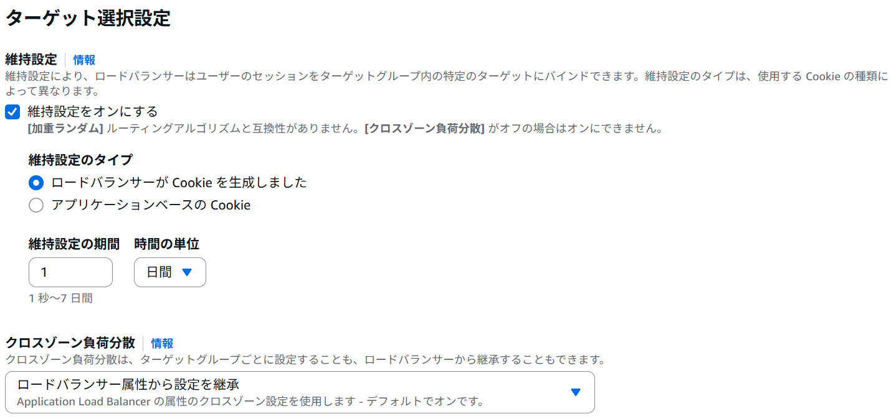
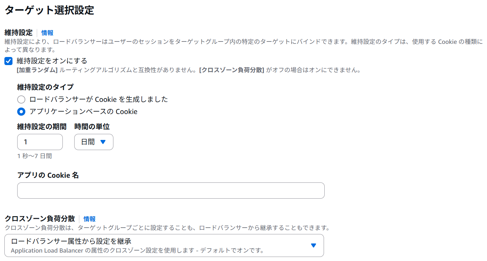
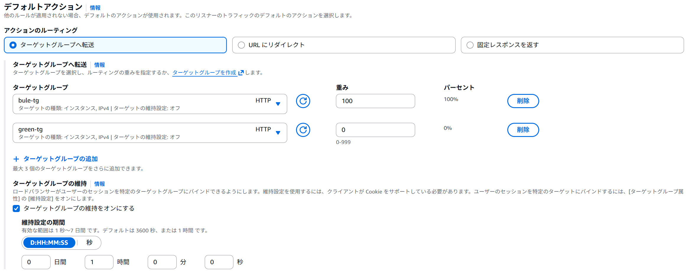
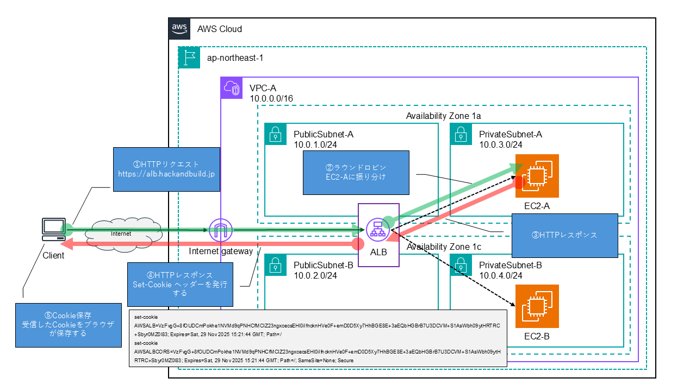
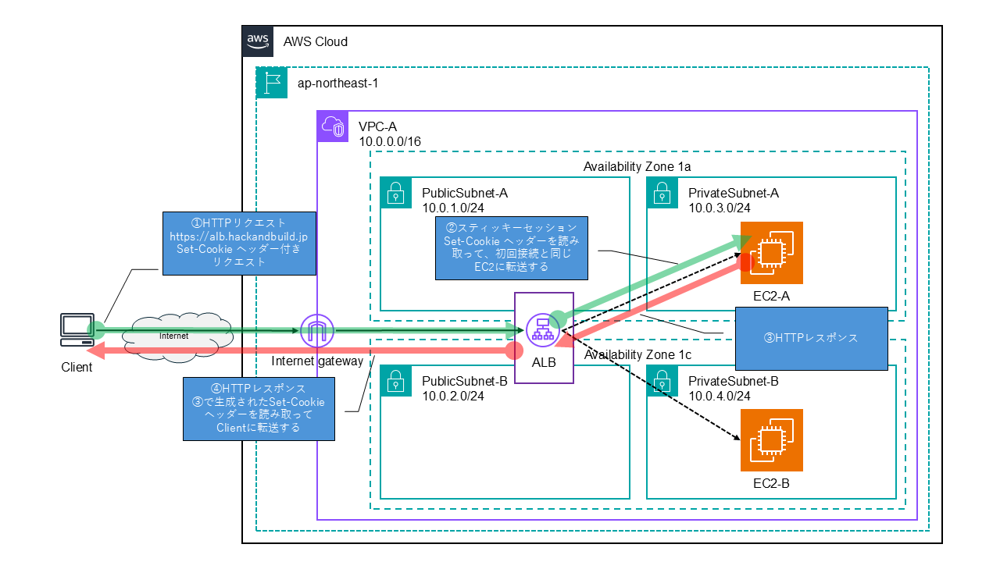
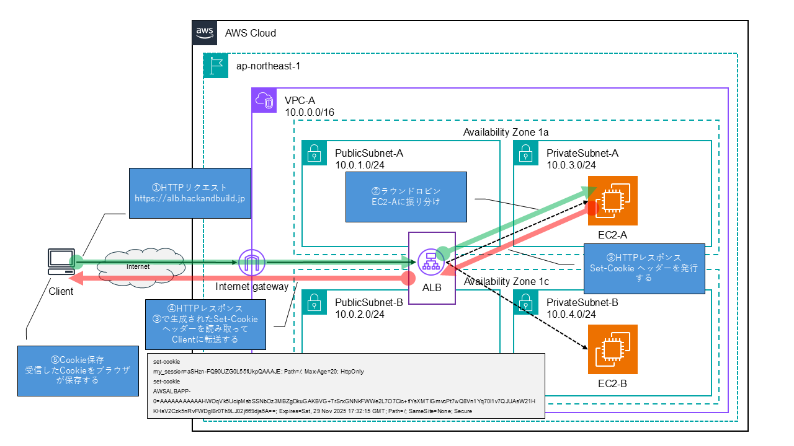
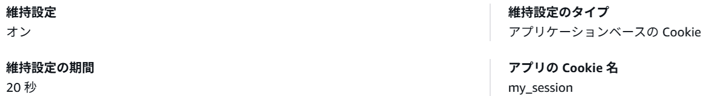
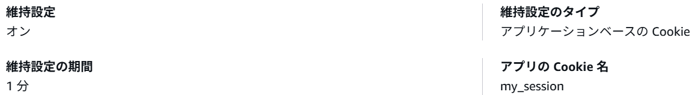

# 1.ALBで利用可能なセッション維持方式

### ■公式ドキュメント

[ロードバランサーの維持戦略の選択 - AWS 規範ガイダンス](https://docs.aws.amazon.com/ja_jp/prescriptive-guidance/latest/load-balancer-stickiness/welcome.html)

### **■スティッキーセッション**

複数のターゲットにトラフィックを分散させるのではなく、クライアントから単一のターゲットにトラフィックを繰り返しルーティングするロードバランサーの機能になります。

維持設定は加重ランダムルーティングアルゴリズムをサポートしておらず、クロスゾーン負荷分散を有効にする必要があり、維持設定は Cookie をサポートするクライアントにのみ利用できます。

設定箇所：ターゲットグループ属性

利用されるリクエストヘッダー：AWSALB / AWSALBCORS

セッション維持設定のタイプとして、以下2つが選択可能になります。

##### ○期間ベースの維持設定

独自の維持設定期間を指定して、ロードバランサーがクライアントのリクエストを同じターゲットにルーティングする時間を管理できます。維持設定のタイプによって、クライアントセッションをターゲットにバインドして維持するために使用される Cookie が決まります。ロードバランサーが生成したCookie は、クライアントセッションをバインドし、ターゲットグループ内の同じターゲットにリクエストをルーティングします。

維持設定の期間は、ロードバランサーによってクライアント接続がバインドされているターゲットとのセッションを維持できる最大時間です。維持設定の期間が経過すると、維持設定が解除され、ターゲットバインディングが変化する可能性があります。維持設定の期間は 1 秒から 7 日間で設定でき、デフォルトは 1 日になります。



##### ○アプリケーションベースの維持設定

アプリケーションベースのCookie を使用してクライアントセッションをバインドし、リクエストをターゲットグループ内の同じターゲットにルーティングします。アプリケーションベースの維持設定では、ターゲットの維持設定にクライアントセッションの独自の基準を柔軟に設定できます。

維持設定の期間は、ロードバランサーによってクライアント接続がバインドされているターゲットとのセッションを維持できる最大時間です。維持設定の期間が経過すると、維持設定が解除され、ターゲットバインディングが変化する可能性があります。維持設定の期間は 1 秒から 7 日間で設定でき、デフォルトは 1 日になります。



### **■ターゲットグループの維持**

主にブルー/グリーンデプロイで利用します。

ブルー/グリーンデプロイとは、「ブルー(旧バージョン)重み：100」、「グリーン(新バージョン)重み：0」として設定を行い、切り替え時に「ブルー(旧バージョン)重み： 0」、「グリーン(新バージョン)重み：100」に重みを変更することでダウンタイムゼロで切り替えが出来る仕組みになります。

利用されるリクエストヘッダー：AWSALBTG / AWSALBTGCORS

設定箇所：リスナーアクション

維持設定の期間は 1 秒から 7 日間で設定でき、デフォルトは 1時間になります。



# 2.スティッキーセッション(期間ベース)検証

### ■検証構成

##### ○ALB設定

ロードバランシングアルゴリズム：ラウンドロビン

維持設定のタイプ：ロードバランサーが Cookie を生成しました

維持設定の期間：20秒

##### ○初回アクセス



##### ○アクセス2回目



### ■初回アクセス

##### ○リクエストヘッダー

初回アクセスのため、set-cookieヘッダーが存在していない事を確認しました。

```
:authority　alb.hackandbuild.jp
:method　GET
:path　/
:scheme　https
accept　text/html,application/xhtml+xml,application/xml;q=0.9,image/avif,image/webp,image/apng,*/*;q=0.8,application/signed-exchange;v=b3;q=0.7
accept-encoding　gzip, deflate, br, zstd
accept-language　ja,en-US;q=0.9,en;q=0.8
cache-control　max-age=0
if-modified-since　Mon, 17 Nov 2025 16:24:53 GMT
if-none-match　"6-643ccc98a2f47"
priority　u=0, i
sec-ch-ua　"Chromium";v="142", "Google Chrome";v="142", "Not_A Brand";v="99"
sec-ch-ua-mobile　?0
sec-ch-ua-platform　"Windows"
sec-fetch-dest　document
sec-fetch-mode　navigate
sec-fetch-site　none
sec-fetch-user　?1
upgrade-insecure-requests　1
user-agent　Mozilla/5.0 (Windows NT 10.0; Win64; x64) AppleWebKit/537.36 (KHTML, like Gecko) Chrome/142.0.0.0 Safari/537.36
```

##### ○レスポンスヘッダー

アクセス先のサーバが分かるようにレスポンスヘッダーにx-backendとして、サーバ識別子を入れます。
ALBからのレスポンスでset-cookieが存在している事を確認しました。

```
accept-ranges　bytes
date　Sat, 22 Nov 2025 15:21:44 GMT
etag　"6-643ccc98a2f47"
last-modified　Mon, 17 Nov 2025 16:24:53 GMT
server　Apache/2.4.65 (Amazon Linux)
set-cookie　AWSALB=VzFvgG+8fOUDCmPokhe1NVMd9qPNHCfMCIZ23ngxcecsEHl0iIfncknHVe0F+emD0D5Xy7HhBGE8E+3aEQbHGBrB7U3DCVM+S1AsWbh09ytHRTRC+Sbyr0MZ0l83; Expires=Sat, 29 Nov 2025 15:21:44 GMT; Path=/
set-cookie　AWSALBCORS=VzFvgG+8fOUDCmPokhe1NVMd9qPNHCfMCIZ23ngxcecsEHl0iIfncknHVe0F+emD0D5Xy7HhBGE8E+3aEQbHGBrB7U3DCVM+S1AsWbh09ytHRTRC+Sbyr0MZ0l83; Expires=Sat, 29 Nov 2025 15:21:44 GMT; Path=/; SameSite=None; Secure
x-backend　EC2-A
```

##### ○リクエストヘッダー

初回アクセスのリクエストヘッダーで発行されたcookieがヘッダーに入っている事を確認しました。

```
:authority　alb.hackandbuild.jp
:method　GET
:path　/
:scheme　https
accept　text/html,application/xhtml+xml,application/xml;q=0.9,image/avif,image/webp,image/apng,*/*;q=0.8,application/signed-exchange;v=b3;q=0.7
accept-encoding　gzip, deflate, br, zstd
accept-language　ja,en-US;q=0.9,en;q=0.8
cache-control　max-age=0
cookie　AWSALB=VzFvgG+8fOUDCmPokhe1NVMd9qPNHCfMCIZ23ngxcecsEHl0iIfncknHVe0F+emD0D5Xy7HhBGE8E+3aEQbHGBrB7U3DCVM+S1AsWbh09ytHRTRC+Sbyr0MZ0l83;
        AWSALBCORS=VzFvgG+8fOUDCmPokhe1NVMd9qPNHCfMCIZ23ngxcecsEHl0iIfncknHVe0F+emD0D5Xy7HhBGE8E+3aEQbHGBrB7U3DCVM+S1AsWbh09ytHRTRC+Sbyr0MZ0l83
if-modified-since　Mon, 17 Nov 2025 16:24:53 GMT
if-none-match　"6-643ccc98a2f47"
priority　u=0, i
sec-ch-ua　"Chromium";v="142", "Google Chrome";v="142", "Not_A Brand";v="99"
sec-ch-ua-mobile　?0
sec-ch-ua-platform　"Windows"
sec-fetch-dest　document
sec-fetch-mode　navigate
sec-fetch-site　none
sec-fetch-user　?1
upgrade-insecure-requests　1
user-agent　Mozilla/5.0 (Windows NT 10.0; Win64; x64) AppleWebKit/537.36 (KHTML, like Gecko) Chrome/142.0.0.0 Safari/537.36
```

##### ○レスポンスヘッダー

EC2-Aからレスポンスがあることを確認しました。
また、レスポンス時に新しいCookieを発行している事を確認しました。

```
accept-ranges　bytes
date　Sat, 22 Nov 2025 15:24:05 GMT
etag　"6-643ccc98a2f47"
last-modified　Mon, 17 Nov 2025 16:24:53 GMT
server　Apache/2.4.65 (Amazon Linux)
set-cookie　AWSALB=XdU38hSjvME8Oljnai8Y4TEU6XKH+NdtGWAqI3pVyi96Awp/ow+IvXW1+JdZV0bcsVthagUlXKe1+eSP72kdfWTRv2PJQPPZWgJ0KebBqGN7kV5upfEQj5lWXxNb; Expires=Sat, 29 Nov 2025 15:24:05 GMT; Path=/
set-cookie　AWSALBCORS=XdU38hSjvME8Oljnai8Y4TEU6XKH+NdtGWAqI3pVyi96Awp/ow+IvXW1+JdZV0bcsVthagUlXKe1+eSP72kdfWTRv2PJQPPZWgJ0KebBqGN7kV5upfEQj5lWXxNb; Expires=Sat, 29 Nov 2025 15:24:05 GMT; Path=/; SameSite=None; Secure
x-backend　EC2-A
```

## ■アクセス2回目以降

F5を連打して、HTTPリクエストを送り続ける限り、HTTPレスポンスで新しいCookieが発行されて、常にアクセス先がEC2-Aに固定されることを確認しました。

##### ○リクエストヘッダー

```
:authority alb.hackandbuild.jp
:method GET
:path /
:scheme https
accept text/html,application/xhtml+xml,application/xml;q=0.9,image/avif,image/webp,image/apng,*/*;q=0.8,application/signed-exchange;v=b3;q=0.7
accept-encoding
gzip, deflate, br, zstd
accept-language
ja,en-US;q=0.9,en;q=0.8
cache-control
max-age=0
cookie AWSALB=xwL7X5fnDJwb/ATYAYqJK4BLh1/4ix3ay78Qq6PoZMkhg3hI+tZ185IA1OafB/o04JQWyh7e8cNq4IDNpPpNZItPqkdD9EmIaILSo9fCMzCLb3hWbBhlDtEp2qPL;
       AWSALBCORS=xwL7X5fnDJwb/ATYAYqJK4BLh1/4ix3ay78Qq6PoZMkhg3hI+tZ185IA1OafB/o04JQWyh7e8cNq4IDNpPpNZItPqkdD9EmIaILSo9fCMzCLb3hWbBhlDtEp2qPL
if-modified-since Mon, 17 Nov 2025 16:24:53 GMT
if-none-match "6-643ccc98a2f47"
priority u=0, i
sec-ch-ua "Chromium";v="142", "Google Chrome";v="142", "Not_A Brand";v="99"
sec-ch-ua-mobile ?0
sec-ch-ua-platform "Windows"
sec-fetch-dest document
sec-fetch-mode navigate
sec-fetch-site none
sec-fetch-user ?1
upgrade-insecure-requests 1
user-agent Mozilla/5.0 (Windows NT 10.0; Win64; x64) AppleWebKit/537.36 (KHTML, like Gecko) Chrome/142.0.0.0 Safari/537.36
```

##### ○レスポンスヘッダー

```
accept-ranges bytes
date Sat, 22 Nov 2025 15:47:21 GMT
etag "6-643ccc98a2f47"
last-modified Mon, 17 Nov 2025 16:24:53 GMT
server Apache/2.4.65 (Amazon Linux)
set-cookie AWSALB=tLVwU/I9CO6V8rI9hIsXUoHbrMUIM/p9+G46wPrgto/ofILzIA6FCaemY8APdT8VAUUnt522s5+eBza//edtMnE8ENq70ilEJHujdY7mBILHcqQ9OvnF0MdrfC5x; Expires=Sat, 29 Nov 2025 15:47:21 GMT; Path=/
set-cookie AWSALBCORS=tLVwU/I9CO6V8rI9hIsXUoHbrMUIM/p9+G46wPrgto/ofILzIA6FCaemY8APdT8VAUUnt522s5+eBza//edtMnE8ENq70ilEJHujdY7mBILHcqQ9OvnF0MdrfC5x; Expires=Sat, 29 Nov 2025 15:47:21 GMT; Path=/; SameSite=None; Secure
x-backend EC2-A
```

### ■Cookie有効期限後のアクセス

Cookieの有効期限まで何も操作しないで、アクセスした場合、セッション維持が解除されて、EC2-Bにアクセスされることを確認しました。

##### ○リクエストヘッダー

```
:authority alb.hackandbuild.jp
:method GET
:path /
:scheme https
accept text/html,application/xhtml+xml,application/xml;q=0.9,image/avif,image/webp,image/apng,*/*;q=0.8,application/signed-exchange;v=b3;q=0.7
accept-encoding gzip, deflate, br, zstd
accept-language ja,en-US;q=0.9,en;q=0.8
cache-control max-age=0
cookie AWSALB=NlMrhL8TCvIT1PN72JU8jmMpOUO1151E+xLCWlKRO6BQ3+L/CJO7amnWUhFSQPAaoSf1CZ49tGnJQVBzFKHLzBcU6t4RhP/54umWNb7S7Jn1m/QnKHj/oiChoUGE;
       AWSALBCORS=NlMrhL8TCvIT1PN72JU8jmMpOUO1151E+xLCWlKRO6BQ3+L/CJO7amnWUhFSQPAaoSf1CZ49tGnJQVBzFKHLzBcU6t4RhP/54umWNb7S7Jn1m/QnKHj/oiChoUGE
if-modified-since Mon, 17 Nov 2025 16:24:53 GMT
if-none-match "6-643ccc98a2f47"
priority u=0, i
sec-ch-ua "Chromium";v="142", "Google Chrome";v="142", "Not_A Brand";v="99"
sec-ch-ua-mobile ?0
sec-ch-ua-platform "Windows"
sec-fetch-dest document
sec-fetch-mode navigate
sec-fetch-site none
sec-fetch-user ?1
upgrade-insecure-requests 1
user-agent Mozilla/5.0 (Windows NT 10.0; Win64; x64) AppleWebKit/537.36 (KHTML, like Gecko) Chrome/142.0.0.0 Safari/537.36
```

##### ○レスポンスヘッダー

```
accept-ranges bytes
content-length 6
content-type text/html; charset=UTF-8
date Sat, 22 Nov 2025 15:52:06 GMT
etag "6-643ccc9ef4d4b"
last-modified Mon, 17 Nov 2025 16:25:00 GMT
server Apache/2.4.65 (Amazon Linux)
set-cookie AWSALB=DWqVdmLATu/50LhBL5H3ncx3sF3wsbqmJ94rRz3VvjqyxaPK+IdrxG6xC7hgk5xolqwpc87Tp5wObqtzW7IcKSMThiacxtJ0stzUfXc41pBTFFZrBrI7Au1XP5E6; Expires=Sat, 29 Nov 2025 15:52:06 GMT; Path=/
set-cookie AWSALBCORS=DWqVdmLATu/50LhBL5H3ncx3sF3wsbqmJ94rRz3VvjqyxaPK+IdrxG6xC7hgk5xolqwpc87Tp5wObqtzW7IcKSMThiacxtJ0stzUfXc41pBTFFZrBrI7Au1XP5E6; Expires=Sat, 29 Nov 2025 15:52:06 GMT; Path=/; SameSite=None; Secure
x-backend EC2-B
```

# 3.スティッキーセッション(アプリケーションベース)検証

### ■検証構成

##### ○ALB設定

ロードバランシングアルゴリズム：ラウンドロビン

維持設定のタイプ：アプリケーションベースのCookie

維持設定の期間：60秒

クロスゾーン負荷分散：ロードバランサー属性から設定を継承(デフォルトでオン)

##### ○アプリケーション設定

アプリケーションのCookie設定：20秒

```
<IfModule unique_id_module>
  <IfModule headers_module>
    Header always set Set-Cookie "my_session=%{UNIQUE_ID}e; Path=/; Max-Age=20; HttpOnly"
  </IfModule>
</IfModule>
```

##### ○初回アクセス



##### ○アクセス2回目


### 初回アクセス

##### ○リクエストヘッダー

初回アクセスのため、set-cookieヘッダーが存在していない事を確認しました。

```
:authority alb.hackandbuild.jp
:method GET
:path /
:scheme https
accept text/html,application/xhtml+xml,application/xml;q=0.9,image/avif,image/webp,image/apng,*/*;q=0.8,application/signed-exchange;v=b3;q=0.7
accept-encoding gzip, deflate, br, zstd
accept-language ja,en-US;q=0.9,en;q=0.8
cache-control max-age=0
if-modified-since Mon, 17 Nov 2025 16:25:00 GMT
if-none-match "6-643ccc9ef4d4b"
priority u=0, i
sec-ch-ua "Chromium";v="142", "Google Chrome";v="142", "Not_A Brand";v="99"
sec-ch-ua-mobile ?0
sec-ch-ua-platform "Windows"
sec-fetch-dest document
sec-fetch-mode navigate
sec-fetch-site none
sec-fetch-user ?1
upgrade-insecure-requests 1
user-agent Mozilla/5.0 (Windows NT 10.0; Win64; x64) AppleWebKit/537.36 (KHTML, like Gecko) Chrome/142.0.0.0 Safari/537.36
```

##### ○レスポンスヘッダー

アクセス先のサーバが分かるようにレスポンスヘッダーにx-backendとして、サーバ識別子を入れます。
ALBからのレスポンスでset-cookieが存在している事を確認しました。

```
accept-ranges bytes
content-length 6
content-type text/html; charset=UTF-8
date Sat, 22 Nov 2025 17:32:15 GMT
etag "6-643ccc98a2f47"
last-modified Mon, 17 Nov 2025 16:24:53 GMT
server Apache/2.4.65 (Amazon Linux)
set-cookie my_session=aSHzn-FQ90UZG0L55fUkpQAAAJE; Path=/; Max-Age=20; HttpOnly
set-cookie AWSALBAPP-0=AAAAAAAAAAAHWOqVk5UcipMsbSSNbOz3MBZgDkuGAKBVG+TrSrxGNNkFWWe2L7O7Cic+fiYsXMTIGmvcPt7wQ8Vn1Yq70l1v7QJUAsW21HKHsV2Czk5nRvFWDglBr0Th9LJ02j669djs6A==; Expires=Sat, 29 Nov 2025 17:32:15 GMT; Path=/; SameSite=None; Secure
set-cookie AWSALBAPP-1=_remove_; Expires=Sat, 29 Nov 2025 17:32:15 GMT; Path=/; SameSite=None; Secure
set-cookie AWSALBAPP-2=_remove_; Expires=Sat, 29 Nov 2025 17:32:15 GMT; Path=/; SameSite=None; Secure
set-cookie AWSALBAPP-3=_remove_; Expires=Sat, 29 Nov 2025 17:32:15 GMT; Path=/; SameSite=None; Secure
x-backend EC2-A
```

### ■アクセス2回目

##### ○リクエストヘッダー

初回アクセスのリクエストヘッダーで発行されたcookieがヘッダーに入っている事を確認しました。

```
:authority alb.hackandbuild.jp
:method GET
:path /
:scheme https
accept text/html,application/xhtml+xml,application/xml;q=0.9,image/avif,image/webp,image/apng,*/*;q=0.8,application/signed-exchange;v=b3;q=0.7
accept-encoding gzip, deflate, br, zstd
accept-language ja,en-US;q=0.9,en;q=0.8
cache-control max-age=0
cookie my_session=aSHzn-FQ90UZG0L55fUkpQAAAJE; AWSALBAPP-0=AAAAAAAAAAAHWOqVk5UcipMsbSSNbOz3MBZgDkuGAKBVG+TrSrxGNNkFWWe2L7O7Cic+fiYsXMTIGmvcPt7wQ8Vn1Yq70l1v7QJUAsW21HKHsV2Czk5nRvFWDglBr0Th9LJ02j669djs6A==;
       AWSALBAPP-1=_remove_; AWSALBAPP-2=_remove_; AWSALBAPP-3=_remove_
if-modified-since Mon, 17 Nov 2025 16:24:53 GMT
if-none-match "6-643ccc98a2f47"
priority u=0, i
sec-ch-ua "Chromium";v="142", "Google Chrome";v="142", "Not_A Brand";v="99"
sec-ch-ua-mobile ?0
sec-ch-ua-platform "Windows"
sec-fetch-dest document
sec-fetch-mode navigate
sec-fetch-site none
sec-fetch-user ?1
upgrade-insecure-requests 1
user-agent Mozilla/5.0 (Windows NT 10.0; Win64; x64) AppleWebKit/537.36 (KHTML, like Gecko)
```

##### ○レスポンスヘッダー

レスポンス時に新しいCookieを発行している事を確認しました。

```
accept-ranges bytes
date Sat, 22 Nov 2025 17:32:32 GMT
etag "6-643ccc98a2f47"
last-modified Mon, 17 Nov 2025 16:24:53 GMT
server Apache/2.4.65 (Amazon Linux)
set-cookie my_session=aSHzsOFQ90UZG0L55fUkqAAAAJg; Path=/; Max-Age=20; HttpOnly
set-cookie AWSALBAPP-0=AAAAAAAAAAAQ5Ucqg5GRq91gB72d8tmL1NAcWEIkRJSnxjoB/6kBU9tLd7QYIoGy3j5h0nve+eZ4Iq0RtGmtKXAdWnQwlRjN79oKzm9esVJW/uv96b4bwkQywsL0XKfsMOfzmZMuIJlLqQ==; Expires=Sat, 29 Nov 2025 17:32:32 GMT; Path=/; SameSite=None; Secure
set-cookie AWSALBAPP-1=_remove_; Expires=Sat, 29 Nov 2025 17:32:32 GMT; Path=/; SameSite=None; Secure
set-cookie AWSALBAPP-2=_remove_; Expires=Sat, 29 Nov 2025 17:32:32 GMT; Path=/; SameSite=None; Secure
set-cookie AWSALBAPP-3=_remove_; Expires=Sat, 29 Nov 2025 17:32:32 GMT; Path=/; SameSite=None; Secure
x-backend EC2-A
```

### ■アクセス2回目以降

F5を連打して、HTTPリクエストを送り続ける限り、HTTPレスポンスで新しいCookieが発行されて、常にアクセス先がEC2-Aに固定されることを確認しました。

##### ○リクエストヘッダー

```
:authority alb.hackandbuild.jp
:method GET
:path /
:scheme https
accept text/html,application/xhtml+xml,application/xml;q=0.9,image/avif,image/webp,image/apng,*/*;q=0.8,application/signed-exchange;v=b3;q=0.7
accept-encoding gzip, deflate, br, zstd
accept-language ja,en-US;q=0.9,en;q=0.8
cache-control max-age=0
cookie AWSALBAPP-1=_remove_; AWSALBAPP-2=_remove_; AWSALBAPP-3=_remove_;
       my_session=aSH4IlEyGiKNglzHV82aOwAAAFQ;
       AWSALBAPP-0=AAAAAAAAAACH3Qca5ubUQjeJYkZAX3qm4+/jrLsfrqApbmRygolUFL5ceOB81CUt9aFSM+lrtMA5XRvZLsFgJ+3qXhZSUx1IHcsBdDhQBgYY4HzK4kaM2eVMxdvC0Xl7UU3C1bvPgSyMDw==
if-modified-since Mon, 17 Nov 2025 16:24:53 GMT
if-none-match "6-643ccc98a2f47"
priority u=0, i
sec-ch-ua "Chromium";v="142", "Google Chrome";v="142", "Not_A Brand";v="99"
sec-ch-ua-mobile ?0
sec-ch-ua-platform "Windows"
sec-fetch-dest document
sec-fetch-mode navigate
sec-fetch-site none
sec-fetch-user ?1
upgrade-insecure-requests 1
user-agent Mozilla/5.0 (Windows NT 10.0; Win64; x64) AppleWebKit/537.36 (KHTML, like Gecko) Chrome/142.0.0.0 Safari/537.36
```

#### ○レスポンスヘッダー

```
accept-ranges bytes
date Sat, 22 Nov 2025 17:51:31 GMT
etag "6-643ccc98a2f47"
last-modified Mon, 17 Nov 2025 16:24:53 GMT
server Apache/2.4.65 (Amazon Linux)
set-cookie my_session=aSH4I1EyGiKNglzHV82aPAAAAFU; Path=/; Max-Age=20; HttpOnly
set-cookie AWSALBAPP-0=AAAAAAAAAAC0FXsGHkfyzT3ZqFtcDQxUjrLKXBFqqVkyCpvcAr2CGeI5b+jeXsW98zG4mwl5D5/fTQMprokcSGZIm4pol3ZnHVfZ3c2xDLSAxhOPtPoLBysxJ0xaDgJehAqUDH3RO/RITg==; Expires=Sat, 29 Nov 2025 17:51:31 GMT; Path=/; SameSite=None; Secure
set-cookie AWSALBAPP-1=_remove_; Expires=Sat, 29 Nov 2025 17:51:31 GMT; Path=/; SameSite=None; Secure
set-cookie AWSALBAPP-2=_remove_; Expires=Sat, 29 Nov 2025 17:51:31 GMT; Path=/; SameSite=None; Secure
set-cookie AWSALBAPP-3=_remove_; Expires=Sat, 29 Nov 2025 17:51:31 GMT; Path=/; SameSite=None; Secure
x-backend EC2-A
```

### ■Cookie有効期限後のアクセス

Cookieの有効期限まで何も操作しないで、アクセスした場合、セッション維持が解除されて、EC2-Bにアクセスされることを確認しました。
セッション有効期限後のHTTPリクエストヘッダーではmy_sessionが存在していない事を確認しました。

##### ○リクエストヘッダー

```
:authority alb.hackandbuild.jp
:method GET
:path /
:scheme https
accept text/html,application/xhtml+xml,application/xml;q=0.9,image/avif,image/webp,image/apng,*/*;q=0.8,application/signed-exchange;v=b3;q=0.7
accept-encoding gzip, deflate, br, zstd
accept-language ja,en-US;q=0.9,en;q=0.8
cache-control max-age=0
cookie AWSALBAPP-1=_remove_; AWSALBAPP-2=_remove_; AWSALBAPP-3=_remove_;
       AWSALBAPP-0=AAAAAAAAAADSmQLCmF5b0PgmDz2d7pK8VkwXsJlRaO+br9n0WvsrW5GRqC6RCe/q+50IBpxL9dbDUikh/XCij4aLDMJWhKNPEAd2H3KZLppWyiQsSrsk1RzLurc18dZdet7LQJemIl26Ow==
if-modified-since Mon, 17 Nov 2025 16:24:53 GMT
if-none-match "6-643ccc98a2f47"
priority u=0, i
sec-ch-ua "Chromium";v="142", "Google Chrome";v="142", "Not_A Brand";v="99"
sec-ch-ua-mobile ?0
sec-ch-ua-platform "Windows"
sec-fetch-dest document
sec-fetch-mode navigate
sec-fetch-site none
sec-fetch-user ?1
upgrade-insecure-requests 1
user-agent Mozilla/5.0 (Windows NT 10.0; Win64; x64) AppleWebKit/537.36 (KHTML, like Gecko)
```

#### ○レスポンスヘッダー

```
accept-ranges bytes
content-length 6
content-type text/html; charset=UTF-8
date Sat, 22 Nov 2025 17:54:00 GMT
etag "6-643ccc9ef4d4b"
last-modified Mon, 17 Nov 2025 16:25:00 GMT
server Apache/2.4.65 (Amazon Linux)
set-cookie my_session=aSH4uK0PzKufoAnRO_4KgQAAAAk; Path=/; Max-Age=20; HttpOnly
set-cookie AWSALBAPP-0=AAAAAAAAAADNJ4jxm0GxdjiW1rGfXIpZx54z/XZw5IhGLk+Ph8v29kaPzozfyl3zEAuT2X7eceNc2ZiqFqoMlVuStrDGusmLUO03KHwNdRluENy2GiW+jNDKTLGbCUYiewoNzpCcqM1ybQ==; Expires=Sat, 29 Nov 2025 17:54:00 GMT; Path=/; SameSite=None; Secure
set-cookie AWSALBAPP-1=_remove_; Expires=Sat, 29 Nov 2025 17:54:00 GMT; Path=/; SameSite=None; Secure
set-cookie AWSALBAPP-2=_remove_; Expires=Sat, 29 Nov 2025 17:54:00 GMT; Path=/; SameSite=None; Secure
set-cookie AWSALBAPP-3=_remove_; Expires=Sat, 29 Nov 2025 17:54:00 GMT; Path=/; SameSite=None; Secure
x-backend EC2-B
```

### ■2つのCookieにおける有効期限の関係性について

ALBで設定したCookieの有効期限とアプリケーションで設定したCookieの有効期限について、ALBはHTTPリクエストから有効期限が短い方を参照してセッション維持を解除します。

##### ○ALBにおけるCookieの有効期限が短い場合のパターン

ALBのCookie有効期限：20秒



アプリケーションのCookie有効期限：60秒

```
<IfModule unique_id_module>
  <IfModule headers_module>
    Header always set Set-Cookie "my_session=%{UNIQUE_ID}e; Path=/; Max-Age=60; HttpOnly"
  </IfModule>
</IfModule>
```

* 20秒以内は操作しない場合でも、セッション維持される
* 20秒以上操作しない場合、セッション維持が解除される

##### ○アプリケーションにおけるCookieの有効期限が短い場合のパターン

ALBのCookie有効期限：1分



アプリケーションのCookie有効期限：20秒

```
<IfModule unique_id_module>
  <IfModule headers_module>
    Header always set Set-Cookie "my_session=%{UNIQUE_ID}e; Path=/; Max-Age=20; HttpOnly"
  </IfModule>
</IfModule>
```

* 20秒以内は操作しない場合でも、セッション維持される
* 20秒以上操作しない場合、セッション維持が解除される

##### ○ALB設定とアプリケーションにおけるCookieの有効期限が同じパターン

ALBのCookie有効期限：1分


アプリケーションのCookie有効期限：60秒

```
<IfModule unique_id_module>
  <IfModule headers_module>
    Header always set Set-Cookie "my_session=%{UNIQUE_ID}e; Path=/; Max-Age=60; HttpOnly"
  </IfModule>
</IfModule>
```

* 60秒以内は操作しない場合でも、セッション維持される
* 60秒以上操作しない場合、セッション維持が解除される

##### ○アプリケーションでCookieの有効期限を設定しないパターン

ALBのCookie有効期限：1分


アプリケーションのCookie有効期限：なし

```
<IfModule unique_id_module>
  <IfModule headers_module>
    Header always set Set-Cookie "my_session=%{UNIQUE_ID}e; Path=/; HttpOnly"
  </IfModule>
</IfModule>
```

* 60秒以内は操作しない場合でも、セッション維持される
* 60秒以上操作しない場合、セッション維持が解除される
