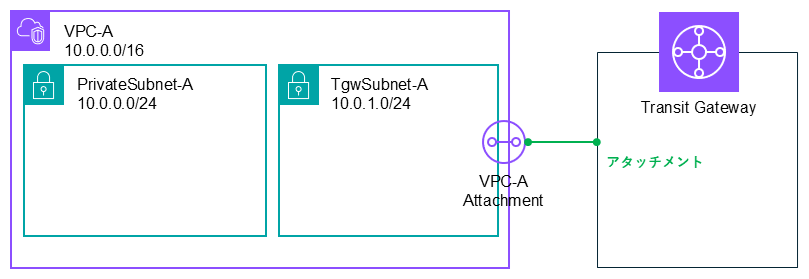
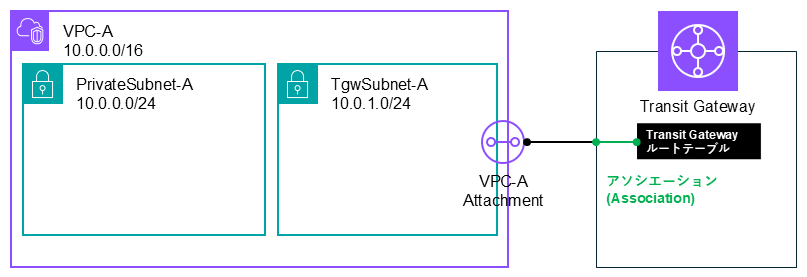
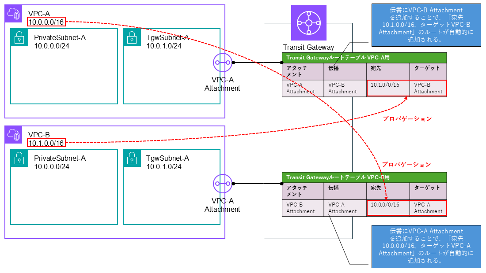
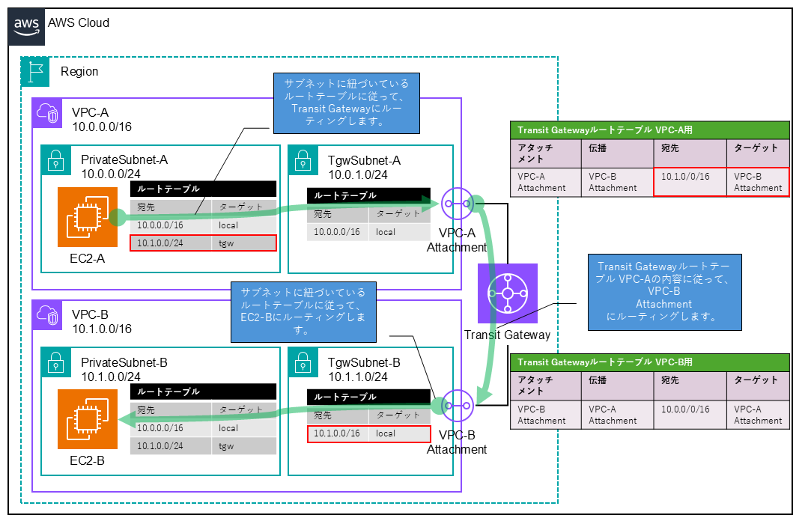
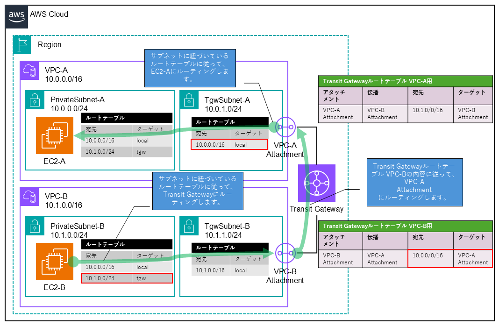
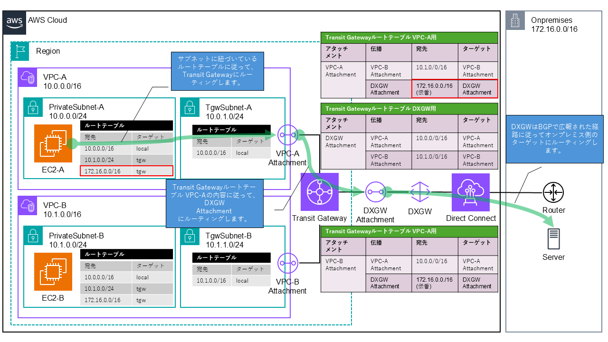
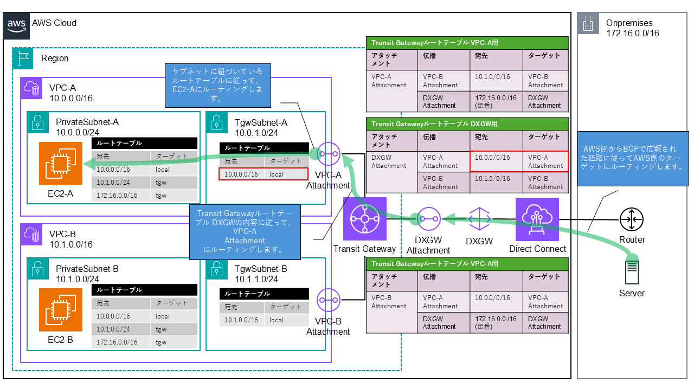
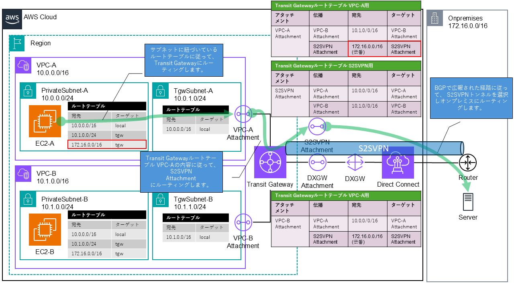

# 1. Transit Gateway構成要素

### 公式ドキュメント

[AWS Transit Gateway for Amazon VPC とは何ですか?- アマゾンVPC](https://docs.aws.amazon.com/vpc/latest/tgw/what-is-transit-gateway.html)

### VPCアタッチメント

Transit Gateway では、VPC を接続するために「VPCアタッチメント」を作成し、Transit Gateway と VPC 内の特定サブネットを関連付ける必要があります。
「VPCアタッチメント」 を作成する際、AWS では Transit Gateway 専用のサブネットを用意し、そのサブネットをVPCアタッチメントに関連付けることを推奨しています。
[AWS Transit Gateway design best practices - Amazon VPC](https://docs.aws.amazon.com/vpc/latest/tgw/tgw-best-design-practices.html)

### アソシエーション

Transit Gateway ルートテーブル と VPCアタッチメント を関連付ける操作 を「アソシエーション（Association）」と呼びます。

### プロパゲーション

VPCアタッチメントが持っているネットワーク情報を Transit Gateway ルートテーブルに伝播させて、自動的に経路を追加することを「プロパゲーション（route propagation）」と言います。

# 2. 構成例

### VPC間通信

EC2-AがEC2-Bに通信するときの経路を以下に示します。

EC2-BがEC2-Aに通信するときの経路を以下に示します。

### DirectConnect通信

EC2-AがオンプレミスのServerと通信するときの経路を以下に示します。

オンプレミスのServerがEC2-Aと通信するときの経路を以下に示します。

### DirectConnectをSitetoSiteVPN(以下S2SVPN)で暗号化して通信

EC2-AがオンプレミスのServerと通信するときの経路を以下に示します。

オンプレミスのServerがEC2-Aと通信するときの経路を以下に示します。

